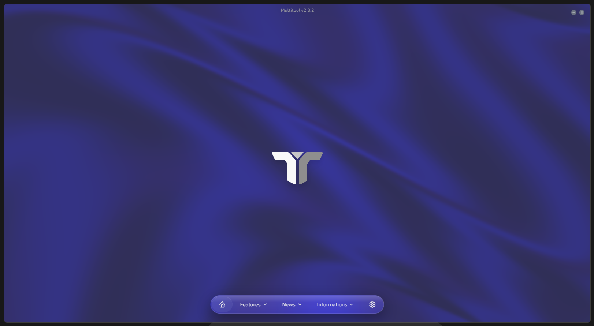
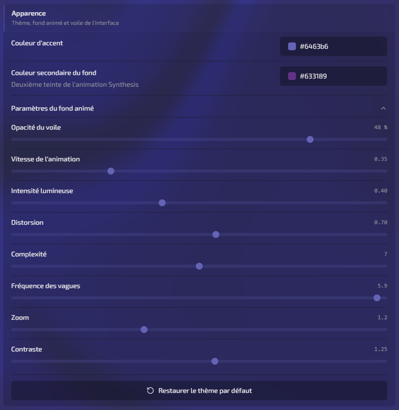

<p align="center">
  
</p>

<h1 align="center">Multitool</h1>

<p align="center">
  L'outil desktop pour Star Citizen — traduction, cache, personnages, blueprints, actualités et mises à jour.
</p>

<p align="center">
  <a href="https://github.com/Onivoid/MultitoolV2/releases/latest">
    
  </a>
  <a href="https://github.com/Onivoid/MultitoolV2/releases">
    
  </a>
  <a href="LICENSE">
    
  </a>
  <a href="https://github.com/Onivoid/MultitoolV2/stargazers">
    
  </a>
</p>

<p align="center">
  
  
  
  
  
  
  
  
</p>

---

## Présentation du logiciel

Tour rapide des pages : traduction, cache, personnages, blueprints, actualités, patchnotes et mises à jour — le tout depuis le dock en bas de l'écran.

https://github.com/user-attachments/assets/d89cce9a-6759-4ce3-96c0-1d2663edb44d

---

## Personnalisation du thème

Multitool ne se contente pas d'un thème sombre fixe. Dans **Paramètres → Apparence**, tu peux façonner l'interface en direct :

- **Couleur d'accent** — boutons, liens et surbrillances UI
- **Couleur secondaire du fond** — deuxième teinte du fond animé Synthesis
- **Fond animé** — opacité du voile, vitesse, lueur, distorsion, complexité, vagues, zoom et contraste
- **Restaurer le thème par défaut** — retour au preset d'origine en un clic

Les réglages sont persistés et s'appliquent immédiatement sur toutes les pages.

<p align="center">
  
</p>

---

## Téléchargement

<p align="center">
  <a href="https://github.com/Onivoid/MultitoolV2/releases/latest">
    
  </a>
</p>

| Fichier                       | Usage                                                    |
| ----------------------------- | -------------------------------------------------------- |
| **`Multitool-Portable.exe`**  | Lance directement, sans installation                     |
| **`Multitool-Installer.msi`** | Installation Windows + mises à jour auto (Tauri updater) |

> Windows peut afficher un avertissement SmartScreen : l'app n'est pas signée. Voir [SECURITY.md](SECURITY.md) pour vérifier les checksums ou rebuilder vous-même.

---

## Fonctionnalités

|                             |                                                                |
| --------------------------- | -------------------------------------------------------------- |
| **Traduction**              | Installation / désinstallation SCEFRA                          |
| **Cache**                   | Nettoyage et ouverture du dossier Star Citizen                 |
| **Personnages**             | Presets locaux + téléchargement depuis Star Citizen Characters |
| **Blueprints**              | Suivi gamelog, import / export                                 |
| **Actualités & patchnotes** | Flux GitHub du projet                                          |
| **Mises à jour**            | Changelog par version + updater intégré (MSI)                  |

---

## Développement

```bash
git clone https://github.com/Onivoid/MultitoolV2.git
cd MultitoolV2
pnpm install
pnpm tauri dev
```

Guides : [CONTRIBUTING.md](CONTRIBUTING.md) · [BUILD.md](BUILD.md) · [VERSIONING.md](VERSIONING.md)

---

## Liens

<p align="center">
  <a href="https://discord.com/invite/aUEEdMdS6j">
    
  </a>
  <a href="https://github.com/Onivoid/MultitoolV2/issues">
    
  </a>
</p>

---

<p align="center">
  <sub>AGPL-3.0-or-later — voir <a href="LICENSE">LICENSE</a></sub>
</p>
