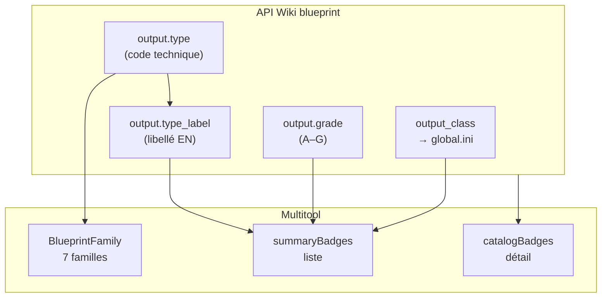

# Taxonomie Blueprints — familles, types Wiki et badges

Référence humaine. Source machine : [`blueprints.taxonomy.reference.ts`](../src/features/blueprints/blueprints.taxonomy.reference.ts).

Implémentation : Rust [`blueprint_family.rs`](../src-tauri/src/scripts/blueprint_family.rs), TS [`blueprints.taxonomy.ts`](../src/features/blueprints/blueprints.taxonomy.ts).

---

## Vue d’ensemble

| Couche                        | Rôle                                          |
| ----------------------------- | --------------------------------------------- |
| `output.type`                 | Classification → `BlueprintFamily`            |
| `output.type_label`           | Badge `output_type` (composants, mining)      |
| `output_class` + `global.ini` | Badge `component_class` (Civilian, Military…) |
| `description_data` (item)     | Badges détail + hero stats                    |
| `blueprint_id`                | Taille `S{n}`, fabricant, classe (fallback)   |

---

## Familles (`BlueprintFamily`)

| Famille          | Rail UI            | `output.type` Wiki (principal)       | Catégorie items/filters |
| ---------------- | ------------------ | ------------------------------------ | ----------------------- |
| `armor`          | Armure             | `Char_Armor_*`                       | `armor`                 |
| `fps_weapon`     | Armes FPS          | `WeaponPersonal`, `WeaponAttachment` | `weapons`               |
| `ship_weapon`    | Armes vaisseau     | `WeaponGun`                          | `vehicle-weapons`       |
| `ship_component` | Composants         | `PowerPlant`, `Shield`, `Cooler`, …  | `vehicle-components`    |
| `mining`         | Mining             | `WeaponMining`                       | `mining-modifiers`      |
| `refuel`         | Refuel             | `DockingCollar`                      | —                       |
| `other`          | _(absent du rail)_ | `Misc`, inconnu                      | —                       |

Les items `other` restent visibles sous **Tous**.

---

## Badges par famille

### Légende

- **Liste** = `build_summary_badges` (sans appel item)
- **Détail** = `build_catalog_badges` (+ `description_data`)
- **Filtre** = clic badge active un filtre catalogue

### `armor`

| Ordre | Kind API      | Source                                         | Exemples labels                                | Liste | Détail | Filtre           |
| ----- | ------------- | ---------------------------------------------- | ---------------------------------------------- | ----- | ------ | ---------------- |
| 1     | `slot`        | `output.type`                                  | Helmet, Torso, Arms, Legs, Backpack, Undersuit | ✓     | ✓      | ✓ (`outputType`) |
| 2     | `armor_class` | `description_data` « Item Type » ou `sub_type` | Light Armor, Heavy Armor                       | ✓\*   | ✓      | ✗                |
| 3     | `stat`        | `description_data` « Damage Reduction »        | 30%, 35%                                       | ✗     | ✓      | ✗                |

\* En liste, seul `sub_type` utile (pas les tokens `medium`/`light`/`heavy` seuls).

Filtres armure avancés (dialog) : tokens `_light_`, `_medium_`, `_heavy_` dans `blueprintId`.

### `fps_weapon`

| Ordre | Kind API       | Source                | Exemples                   | Liste | Détail | Filtre |
| ----- | -------------- | --------------------- | -------------------------- | ----- | ------ | ------ |
| 1     | `size`         | taille blueprint      | S1, S2, S3                 | ✓     | ✓      | ✓      |
| 2     | `item_type`    | description           | Pistol, SMG, Assault Rifle | ✗     | ✓      | ✗      |
| 3     | `weapon_class` | description « Class » | Class 1, Class 2           | ✗     | ✓      | ✗      |

Pas de badge `output_type` en liste (évite « Medium », « Gun »).

### `ship_component`

| Ordre | Kind API          | Source           | Exemples                                                    | Liste | Détail | Filtre                |
| ----- | ----------------- | ---------------- | ----------------------------------------------------------- | ----- | ------ | --------------------- |
| 1     | `output_type`     | `type_label`     | Power Plant, Shield Generator, Cooler, Quantum Drive, Radar | ✓     | ✓      | ✓ (`outputTypeLabel`) |
| 2     | `grade`           | `output.grade`   | A, B, C, D, E, F, G                                         | ✓     | ✓      | ✓                     |
| 3     | `size`            | id / description | S1, S2, S3, S4                                              | ✓     | ✓      | ✓                     |
| 4     | `component_class` | global.ini       | Civilian, Military, Industrial, Stealth, Competition        | ✓     | ✓      | ✓ (`class`)           |
| 5     | `manufacturer`    | Wiki             | Basilisk, Aegis Dynamics, …                                 | ✓     | ✓      | ✓                     |

Exemple liste idéal (Citadel) : `Shield Generator` · `B` · `S2` · `Industrial` · `Basilisk`.

### `ship_weapon`

| Ordre | Kind API      | Source       | Exemples                                 | Liste | Détail | Filtre |
| ----- | ------------- | ------------ | ---------------------------------------- | ----- | ------ | ------ |
| 1     | `size`        | taille       | S1–S5                                    | ✓     | ✓      | ✓      |
| 2     | `output_type` | `type_label` | Laser Cannon, Ballistic Cannon, Repeater | ✗     | ✓      | ✓      |

Pas de `output_type` en liste si label générique (`Weapon Gun`, `Medium`, `Gun`).

### `mining`

| Ordre | Kind API      | Source       | Exemples                    | Liste | Détail | Filtre |
| ----- | ------------- | ------------ | --------------------------- | ----- | ------ | ------ |
| 1     | `size`        | taille       | S1, S2                      | ✓     | ✓      | ✓      |
| 2     | `output_type` | `type_label` | Mining Laser, Mining Module | ✓     | ✓      | ✓      |

### `refuel`

| Ordre | Kind API       | Source      | Exemples                    | Liste | Détail | Filtre |
| ----- | -------------- | ----------- | --------------------------- | ----- | ------ | ------ |
| 1     | `manufacturer` | Wiki        | Greycat Industrial, …       | ✓     | ✓      | ✓      |
| 2     | `item_type`    | description | Docking Collar, Fuel Nozzle | ✗     | ✓      | ✗      |

### `other`

Aucun badge en liste. Hero stats : Item Type, Manufacturer, Class.

---

## Labels interdits (badges)

Ne jamais afficher comme badge `output_type` / `sub_type` :

`gun`, `medium`, `light`, `heavy`, `weapon gun`, `weapon`, `misc`, `standard`, `normal`, `default`, `personal`, `vehicle`, …

Liste complète : `GENERIC_BADGE_LABELS` dans `blueprints.taxonomy.reference.ts`.

---

## Codes classe (`BlueprintClassCode`)

| Code   | Badge EN    | Badge FR (filtre) |
| ------ | ----------- | ----------------- |
| `civi` | Civilian    | Civil             |
| `mili` | Military    | Militaire         |
| `indu` | Industrial  | Industriel        |
| `stlh` | Stealth     | Furtif            |
| `comp` | Competition | Compétition       |

Source : description item « Class » ou segment `bp_craft_*` + `global.ini`.

---

## Mapping Wiki → champs Multitool

| Champ Wiki           | Champ app                    | Usage badge / filtre                          |
| -------------------- | ---------------------------- | --------------------------------------------- |
| `output.type`        | `outputType`                 | Famille, filtre `outputType`                  |
| `output.type_label`  | `outputTypeLabel`            | Badge `output_type`, filtre `outputTypeLabel` |
| `output.grade`       | `grade`                      | Badge `grade`                                 |
| `output_class`       | `internalName` / `classCode` | Badge `component_class`                       |
| `output.uuid`        | item crafté                  | Index meta, détail                            |
| `key` (`bp_craft_*`) | `blueprintId`                | Taille, fabricant, tokens armure              |

---

## Hero stats (panneau détail)

Clés `description_data` lues par priorité (max 4) — voir `HERO_STAT_KEYS_BY_FAMILY`.

---

## Fichiers liés

| Fichier                            | Rôle                                 |
| ---------------------------------- | ------------------------------------ |
| `blueprints.taxonomy.reference.ts` | Types + constantes de référence      |
| `blueprint_family.rs`              | Classification + construction badges |
| `blueprints.catalog.lib.ts`        | Mapping badge → filtre UI            |
| `docs/wiki-api-blueprints.md`      | Endpoints API Wiki                   |
